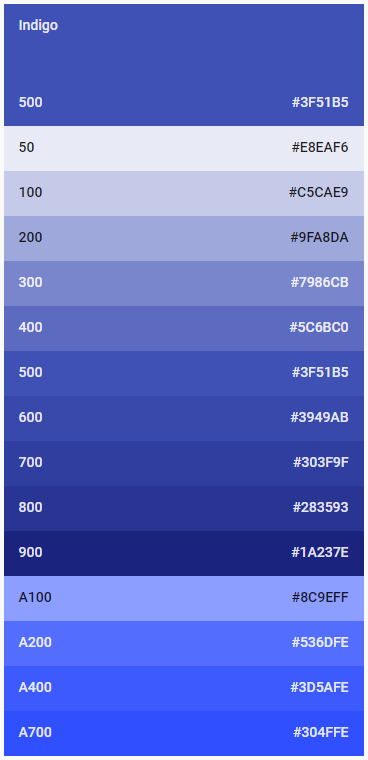

# Notes

This file is intended to contain basic details of site theming, basic deign choices that must be maintained throughout, and general riff-raff that don't have any other place to go in the repo.

## Color theme

Main site color is **Indigo**, based on [Material color scheming](https://material.io/guidelines/style/color.html#color-color-palette):

While not necessarily ideal, the 900 value - **#1A237E** - is a primary color choice for the time being.

I admit I am not much of a designer, so I will need someone else to consult on this sometime later.
